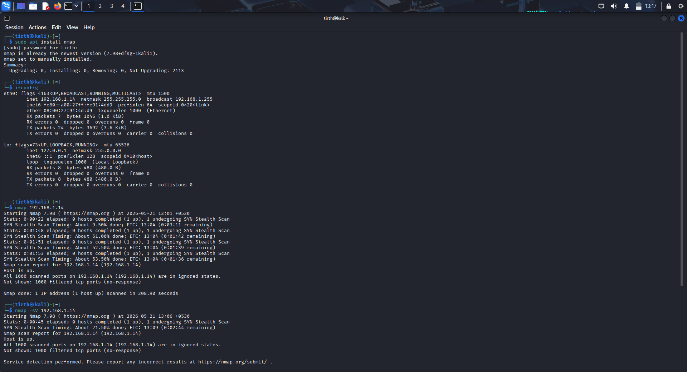
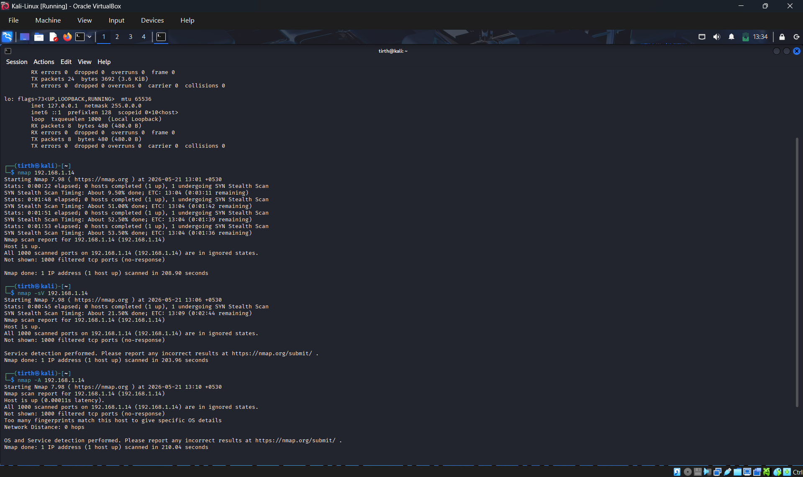
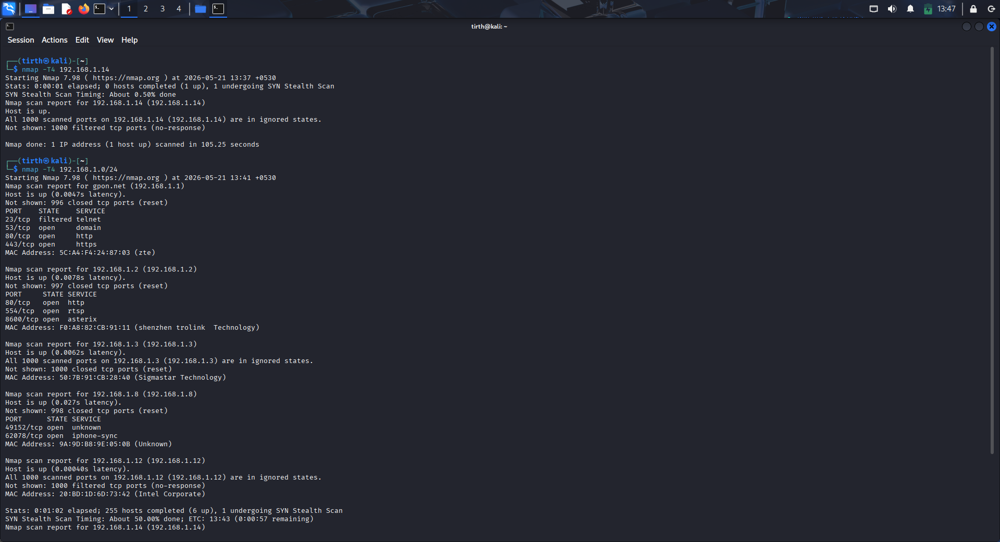
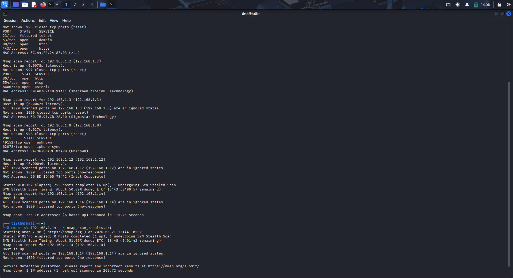
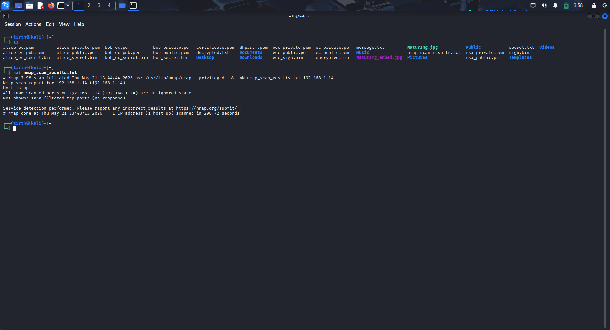
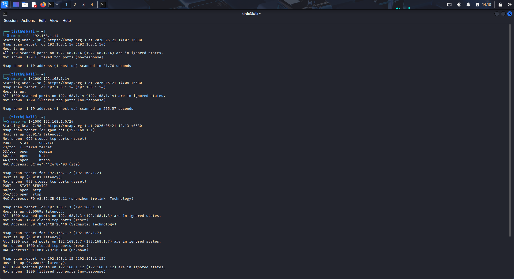
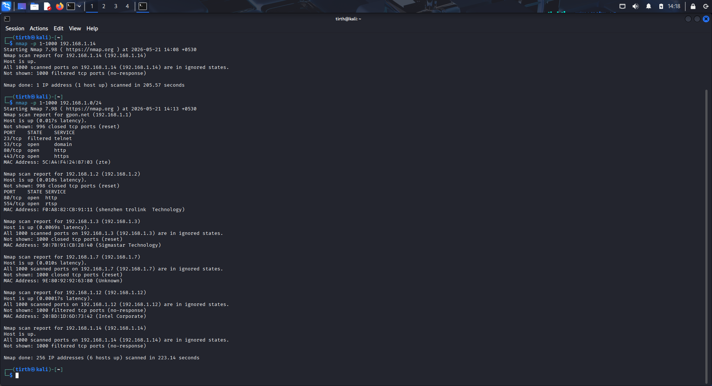

# Task 1 - Network Scan Report Using Nmap

## Internship Details

**Intern Name:** Tirthkumar Harishbhai Patel  
**Internship Role:** Security Analyst Internship  
**Organization:** Oasis Infobyte  

---

## Project Overview

This project demonstrates practical network scanning and reconnaissance using **Nmap** in **Kali Linux**. The task was performed to understand how network scanning tools work and how cybersecurity professionals identify hosts, services, and open ports in a network.

The implementation includes host discovery, service detection, aggressive scanning, port scanning, and saving scan results.

---

## Objective

The objective of this project was to:

- Understand working of Nmap
- Find system IP address
- Perform host discovery
- Scan ports on a target system
- Detect running services
- Identify devices available in local network
- Perform network reconnaissance
- Save scan outputs into a file

---

## Tools and Technologies Used

- Kali Linux
- Nmap
- Oracle VirtualBox

---

## Commands Used

### Verify Installation

```bash
sudo apt install nmap
```

### Find IP Address

```bash
ifconfig
```

### Basic Host Scan

```bash
nmap 192.168.1.14
```

### Service Version Detection

```bash
nmap -sV 192.168.1.14
```

### Aggressive Scan

```bash
nmap -A 192.168.1.14
```

### Fast Timing Scan

```bash
nmap -T4 192.168.1.14
```

### Network Discovery Scan

```bash
nmap -T4 192.168.1.0/24
```

### Port Range Scan

```bash
nmap -p 1-1000 192.168.1.14
```

```bash
nmap -p 1-1000 192.168.1.0/24
```

### Save Scan Results

```bash
nmap -sV 192.168.1.14 -oN nmap_scan_results.txt
```

### View Saved Results

```bash
cat nmap_scan_results.txt
```

---

## Results

- Successfully verified Nmap installation
- Identified local system IP address
- Performed host scanning
- Performed service detection
- Identified devices connected in local network
- Scanned port ranges
- Saved results into output file
- Understood practical use of network reconnaissance

---

## Results















## Learning Outcome

This project provided hands-on experience with network scanning concepts and helped understand practical cybersecurity operations using Nmap.

---

## Repository Structure

```
OIBSIP/
│
├── README.md
│
├── Task1_NetworkScan_Nmap/
│   ├── README.md
│   ├── TirthkumarHarishbhaiPatel_Task1_NetworkScanReport.docx


```

---

## Submission Requirements Completed

✔ GitHub Repository Maintained  
✔ Project Documentation Added  
✔ Screenshots Included  
✔ Practical Demonstration Completed  

---

## Author

**Tirthkumar Harishbhai Patel**

Security Analyst Internship – Oasis Infobyte
