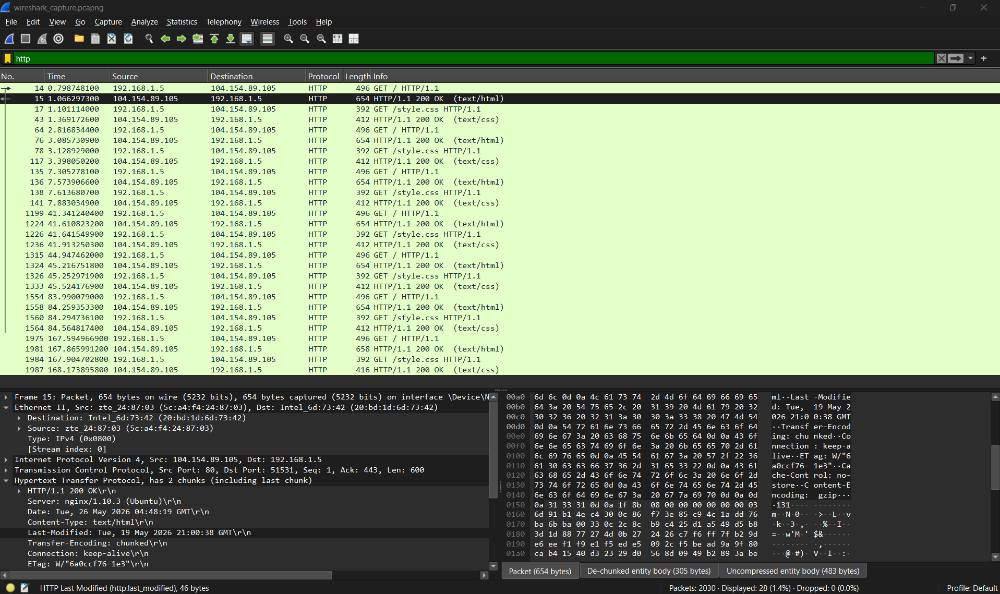
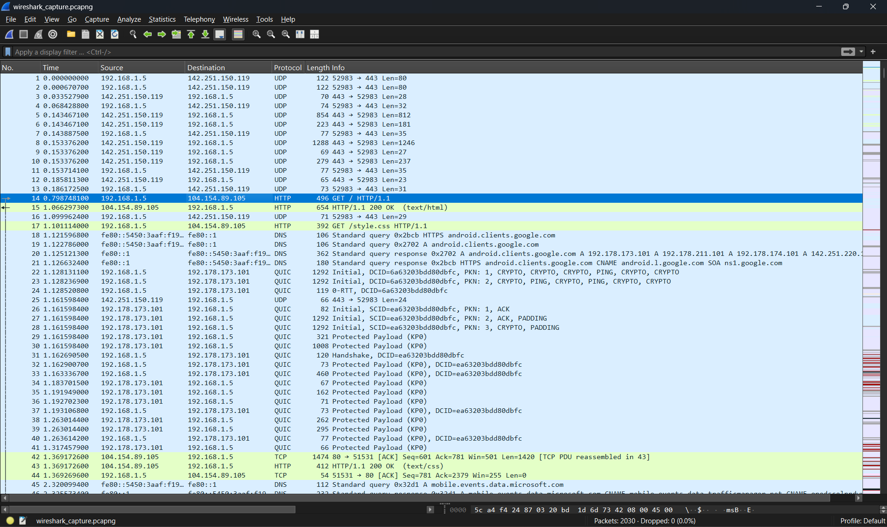

# Task 8 - Capture Network Traffic with Wireshark

## Internship Details

**Intern Name:** Tirthkumar Harishbhai Patel  
**Internship Role:** Security Analyst Internship  
**Organization:** Oasis Infobyte  

---

## Project Overview

This task was performed to understand how network traffic can be captured and analyzed using Wireshark. Packet analysis is an important part of cybersecurity because it helps understand how systems communicate within a network.

In this task, Wireshark was used to capture live network traffic and analyze HTTP packets generated while accessing a website. This activity helped in understanding packet flow, request-response communication, and network monitoring techniques.

---

## Objective

The objective of this task was to:

- Understand network packet capturing
- Learn packet analysis using Wireshark
- Capture HTTP traffic
- Analyze HTTP requests and responses
- Understand client-server communication
- Learn packet filtering techniques
- Observe network protocols in real time

---

## Tools Used

- Wireshark
- Windows Operating System
- Web Browser
- Internet Connection

---

## Steps Performed

### 1. Install Wireshark

Wireshark was installed successfully on the system.

### 2. Start Packet Capture

Opened Wireshark and selected the active Wi-Fi network interface.

### 3. Generate HTTP Traffic

Opened the following website to generate HTTP traffic:

```
http://http.badssl.com
```

### 4. Apply HTTP Filter

Applied the following display filter:

```bash
http
```

### 5. Analyze Captured Packets

Observed HTTP packets and analyzed request-response communication.

---

## Traffic Statistics

Total packets captured:

```
2030 packets
```

HTTP packets identified:

```
28 packets
```

HTTP traffic percentage:

```
1.4% of total captured traffic
```

The remaining packets belonged to protocols such as TCP, DNS, TLS, and QUIC which are commonly seen during normal network communication.

---

## Packet Analysis

The following HTTP packets were observed during packet inspection.

### HTTP GET Request

Example:

```
GET / HTTP/1.1
```

This request was generated by the browser to access webpage content from the server.

---

### HTTP Response

Example:

```
HTTP/1.1 200 OK
```

This response confirmed that the server successfully processed the request.

---

### CSS Resource Request

Example:

```
GET /style.css HTTP/1.1
```

The browser requested styling resources required for webpage rendering.

---

## Network Details Observed

Source IP:

```
192.168.1.5
```

Destination IP:

```
104.154.89.105
```

Protocols Observed:

- HTTP
- TCP
- IPv4

---

## Findings

- Successfully captured live network traffic
- Total packets captured: 2030
- HTTP packets identified: 28
- HTTP GET requests captured successfully
- HTTP response packets analyzed
- Browser resource loading requests observed
- Client-server communication verified
- Packet filtering performed successfully using Wireshark

---

## Files Included

```
TirthPatel_Task8/
│
├── README.md
├── wireshark_capture.pcapng
├── wireshark_screenshot_with_http_filter.png
└── wireshark_screenshot1.png
```

---

## Screenshots

### 1. HTTP Packet Filtering

This screenshot shows Wireshark after applying the HTTP display filter. Out of 2030 captured packets, 28 HTTP packets were identified successfully.



---

### 2. Packet Analysis

This screenshot shows packet-level inspection including HTTP requests, responses, protocol information, source IP, and destination IP details.



---

## Learning Outcome

This task provided practical understanding of:

- Packet capturing using Wireshark
- HTTP communication flow
- Client-server communication
- Packet filtering methods
- Network monitoring concepts
- Protocol analysis techniques
- Cybersecurity traffic monitoring basics

---

## Conclusion

This task provided practical experience in capturing and analyzing network traffic using Wireshark. HTTP packets were captured successfully and analyzed to understand how browser-server communication takes place.

The activity improved practical knowledge of network packet analysis and demonstrated how packet monitoring is useful in cybersecurity.

---

## Author

**Tirthkumar Harishbhai Patel**

Security Analyst Internship – Oasis Infobyte
